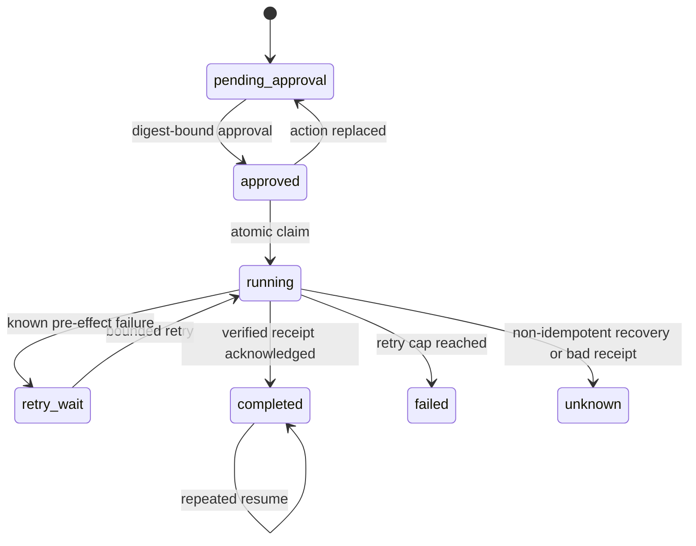

# Architecture

ResumeProof separates the orchestrator’s belief from the simulated tool’s durable facts. The journal and tool ledger are different SQLite files and never share a transaction.

```mermaid
sequenceDiagram
    participant H as Human approver
    participant P as Workflow process
    participant J as Journal SQLite
    participant T as Tool-ledger SQLite
    H->>J: approve(action_digest)
    P->>J: BEGIN IMMEDIATE; claim attempt
    P->>T: apply(action, idempotency_key)
    T-->>T: commit simulated effect + receipt
    Note over P: injected os._exit(86)
    participant R as Restarted process
    R->>J: observe running workflow
    R->>T: retry same key
    T-->>R: original receipt (replayed=true)
    R->>J: persist receipt and completed
```

The journal owns workflow identity, canonical action JSON and SHA-256 digest, approval digest and actor, attempt limit, state, acknowledgement receipt, and append-only replay events. `BEGIN IMMEDIATE` fences each state transition. A per-journal OS file lock remains held across claim, tool call, and acknowledgement; process death releases it. This narrow local v0.1 serializes all workflows in one journal. Multi-host deployment would require a durable lease with fencing tokens instead.

The tool ledger owns effects, invocation-to-receipt links, receipt hashes, and a deterministic pre-effect failure counter used by tests. Its effect and invocation records commit together. A replay validates the requested action digest, invocation, receipt presence, and receipt hash before returning the original receipt.

For a non-idempotent tool, the ledger intentionally stores a null idempotency key. If the journal remains `running` after restart, the engine cannot infer whether the effect happened. It transitions to `unknown` without calling the tool. This is the honest boundary: the local databases cannot create exactly-once semantics around an arbitrary external API.

## State model



`max_retries` is the maximum total attempts, including the first attempt. Failures proven to occur before an effect may retry. Ambiguous failures do not consume retries; they stop for reconciliation.

Terminal, running, and unknown workflows cannot be approved again or have their actions replaced. An operator can close an `unknown` workflow only through the explicit `reconcile` transition, choosing `confirmed_applied` or `confirmed_not_applied`; the actor and decision are appended to the timeline. Actor labels are not authentication in v0.1.
